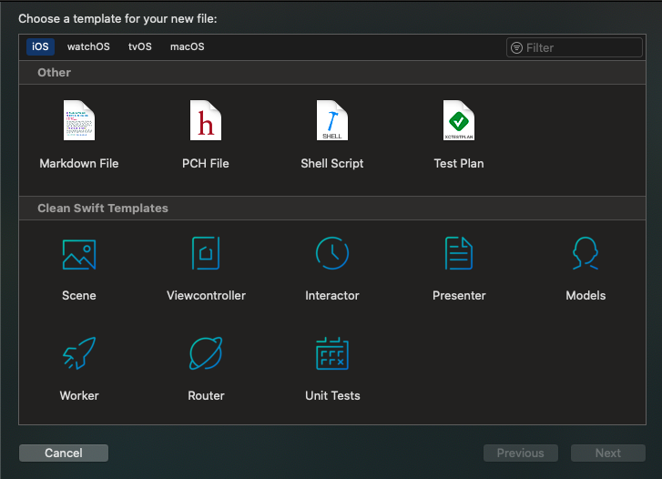

> Clean Swift XCode templates, allowing easy creation of scenes and components when using Clean Swift (VIP) architecture for your apps.

[![Swift Version][swift-image]][swift-url]
[![License][license-image]][license-url]

After a couple of years using Clean Swift architecture, I've come up with this templates to simplify my development cycle. As it may be useful for any other developers out there, feel free to download and use them in your projects. This templates are modified to suit my own tastes and coding style, so feel free to modify them if you need it.

Additional information about Clean Swift architecture can be found here: [Clean Swift Official Website](https://clean-swift.com/)

## Features

- [x] Simple to use
- [x] Writes most of the boilerplate associated with the architecture
- [x] Comes with Unit Tests

## Installation

To install these custom Clean Swift Xcode templates, download or clone them, then run:

> make install_templates

To uninstall the templates, run:

> make uninstall_templates

Then, you will see the new items showing in XCode's 'new file' menu:

## Basic Usage

Using this templates should be pretty straightforward. Whenever you start a new scene, just select the Scene item in the file creation menu and give your scene a name. All the objects created will share the same name.

| Scene name        | Viewcontroller     |  Interactor           |  Presenter           | Model                 | Router                 | Worker                |
| ------------------- | ------------------- | ------------------- | ------------------- | ------------------- | ------------------- | ------------------- |
| UserProfile          | UserProfileViewController | UserProfileInteractor | UserProfilePresenter | UserProfileModel | UserProfileRouter | UserProfileWorker |

If any of the elements isn't needed (worker, router, whatever) just delete them after creation and fix obvious compilation errors. If needed, you can recreate them at a later time using the corresponding component template.

Every component of the scene comes with some empty methods named `doSomething`. Those methods should allow you to understand how all this components work together.

## Contribute

If you want to contribute my **Clean Swift Templates**, check the `LICENSE` file for more info.

## Meta

Guillem Espejo –  g.espejogarcia@gmail.com

Distributed under the MIT license. See `LICENSE` for more information.

[https://github.com/GuillemEspejo/github-link](https://github.com/GuillemEspejo/)

[swift-image]:https://img.shields.io/badge/swift-5.0-orange.svg
[swift-url]: https://swift.org/
[license-image]: https://img.shields.io/badge/License-MIT-blue.svg
[license-url]: LICENSE
